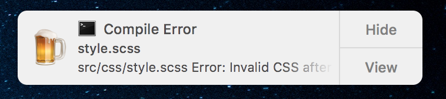
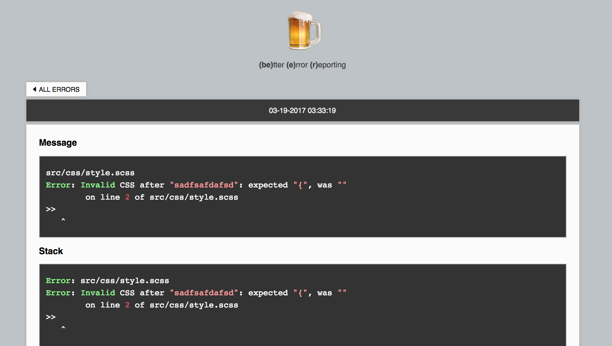

<div style="text-align:center; margin-bottom: 20px;">
<div style="font-size: 64px; line-height:1em;">🍺</div>
  <div style="font-size: 34px; line-height:1.2em;">gulp-beer</div>
  <div style="font-size: 12px">
    <hr style="width: 150px; margin: 3px auto; height: 1px;">
    <strong>(be)</strong>tter
    <strong>(e)</strong>rror
    <strong>(r)</strong>eporting
  </div>
</div>

**gulp-beer**: better error reporting.

gulp-beer is a simple error handler function that provides some extra features:

- **Interactive System Notification** (thanks to [node-notifier](https://github.com/mikaelbr/node-notifier))
- **Custom Error Server** (opened on notification click) that display all your errors in a more pleasent and straightforward way.

**Interactive System Notification**


**Custom Error Server**


## Installation

```
$ npm install --save-dev gulp-beer
```

## Usage

Require gulp-beer in your *gulpfile.js*:

```js
var gulpBeer = require('gulp-beer');
```

than simply pass required function as error handler function wherever you like:

```js
gulp.src('*')
  // stream error
  .on('error', gulpBeer)
  // Plumber
  .pipe(plumber({errorHandler: gulpBeer}))
  // Other error listener
  .pipe(sass().on('error', gulpBeer))
```

You can also call it manually if an error object must be handled

```js
var customFunction(err, result) {
  if (err) gulpBeer(err);
}
```

## (!!) Start error server (!!)

Since error server prevents the gulp process to finish, it has to be started manually when needed (usually when performing a watching task).

Error Handler function expose the server object, so you can do:

```js
gulpBeer.server.start() // to start the error server
```

```js
gulpBeer.server.stop() // to stop the error server
```

A simple usage example:

```js
var gulp = require('gulp');
var gulpBeer = require('../gulp-beer');
var plumber = require('gulp-plumber');
var sass = require('gulp-sass');

function build() {
	return gulp.src('./src/css/*.scss')
  		.pipe(plumber({errorHandler: gulpBeer}))
        .pipe(sass())
        .pipe(gulp.dest('./dist/css'));
}

gulp.task('build', build);
gulp.task('watch', function() {
    gulpBeer.server.start();
    gulp.watch('./src/css/*.scss', ['build']);
});


```

Otherwise, if you prefer start it automatically, take a look at the option server.autostart in the "customize handler" section.


## Customize Handler

If you like, you can customize the error handler function and the error server.

First of all require the custom module:

```js
var gulpBeerFactory = require('gulp-beer/custom');
```
This will return a factory for the error handler function, which accepts some options as first parameter.

```js
var errorHandler = gulpBeerFactory(options);
```

#### Options
---

`consoleError` <small>[function]</small> : the function that will be used to print the error in the console.

It receives the error object as first argument, decorated with a custom property:

  - `serverUrl` <small>[string | false]</small>: the link to the custom error server related to this specific error

---

`title` <small>[string]</small> Title of the system notification

---

`sound` <small>[boolean | string]</small> Notification sound as described [here](https://github.com/mikaelbr/node-notifier#cross-platform-advanced-usage)

---

`icon` <small>[boolean | string]</small> Notification sound as described [here](https://github.com/mikaelbr/node-notifier#cross-platform-advanced-usage)

---

`server` <small>[object | false]</small> Server configuration object. If `false` the server start will be prevented also if started manually.

Server configuration object accepts the following properties:

- `port` <small>[number]</small> : Port on which the server will listen
- `autostart` <small>[boolean]</small> : If true, the server will be started automatically
- `silent` <small>[boolean]</small> : Silents server console output
